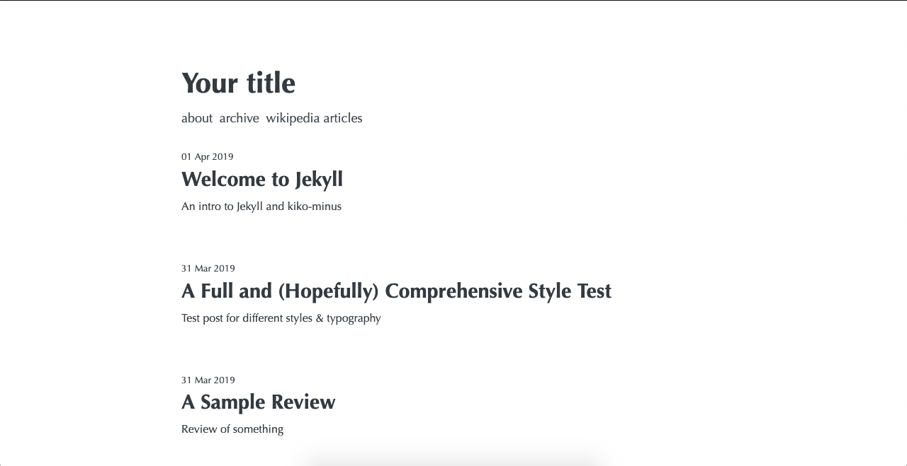

# kiko-minus

[](https://badge.fury.io/rb/kiko-minus)

kiko-minus is a minimalistic Jekyll theme based on [kiko-plus](https://github.com/aweekj/Kiko-plus).

While the design and styles are largely inherited from the original theme, kiko-minus strips away heavy dependencies like Google Analytics and Disqus in favor of lightweight alternatives. It comes with many additional features with an emphasis on privacy and speed, including automatically compressed images, gzip compression, and SEO optimization.



## Features
- Ready for use with GitLab or GitHub pages
- Syntax highlighting
- Automatic image compression
- Zopfli compression (gzip)
- Fully responsive
- Automatic sitemap generation
- Filtered pagination based on tags & collections
- Private Comments with [ISSO](https://posativ.org/isso/)
- Analytics with [Fathom](https://usefathom.com/)
- Automatic Atom feed
- No JavaScript, third party requests, or cookies (unless using Fathom or ISSO)
- Structured data support (TODO)

## Installation

Add this line to your Jekyll site's `Gemfile`:

```ruby
gem "kiko-minus"
```

Copy this [configuration](https://github.com/ask616/kiko-minus/blob/master/_config.yml) to your site's `_config.yml`.

And then execute:

    $ bundle

Or install it yourself as:

    $ gem install kiko-minus

## Contents
kiko-minus has an assortment of components to minimize additional needed configuration, so that all you need to do is add your posts to `_posts/` and be ready to go.

### Layouts (`_layouts/`)
* `default.html` defines the basic structure of every page, including SEO tags, stylesheet imports, and favicons.
* `home.html` is used for the index page, and includes a navigation bar and the paginated list of all posts.
* `page.html` is used for individual pages i.e. an About or Contact page.
* `post.html`
* `filtered-home.html`
* `archive.html`

### Includes (`_includes/`)
* `footer.html`
* `post-list.html`
* `isso.html`
* `fathom.html`

### Sass (`_sass/`)
`kiko-minus.scss`

Inside `kiko-minus/`:
* `_colors.scss`
* `_layout.scss`
* `_normalize.scss`
* `_syntax-highlighting.scss`
* `_typography.scss`

### Assets (`assets/`)
* `css/`
* `img/`

`img_archive/`

### Misc
* `.image-optim-cache`
* `categories/` and `tags/`
* `pages/`
* `index.md`

## Usage

### Custom Stylesheets

### ISSO Integration

### Fathom Integration

### Category and Tag Pages

### Favicons

### SEO Setup

## Contributing

Bug reports and pull requests are welcome on GitHub at https://github.com/ask616/kiko-minus/issues. This project is intended to be a safe, welcoming space for collaboration, and contributors are expected to adhere to the [Contributor Covenant](http://contributor-covenant.org) code of conduct.

## Development

To set up your environment to develop this theme, run `bundle install`.

Your theme is setup just like a normal Jekyll site! To test your theme, run `bundle exec jekyll serve` and open your browser at `http://localhost:4000`. This starts a Jekyll server using your theme. Add pages, documents, data, etc. like normal to test your theme's contents. As you make modifications to your theme and to your content, your site will regenerate and you should see the changes in the browser after a refresh, just like normal.

When your theme is released, only the files in `_layouts`, `_includes`, `_sass` and `assets/css` tracked with Git will be bundled.
To add a custom directory to your theme-gem, please edit the regexp in `kiko-minus.gemspec` accordingly.

## License

The theme is available as open source under the terms of the [MIT License](https://opensource.org/licenses/MIT).
